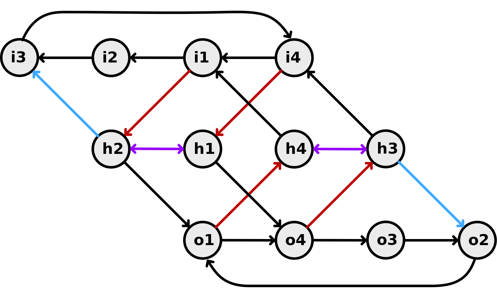

# About Asalato Notation

While learning asalato I found it frusting that I could not fully describe the various tricks I was learning in a succinct manner, as well as finding it impossible to know what the rhythm should sound like (without either watching videos or practicing until it became apparent).

This article covers my journey in notation, but if you just want read / use this as a learning tool feel free to go to the learn asalato page. 

I learned asalato by following a few different youtube tutorials and reading a few different sites.
  TODO: sources

This led me to learn the 4 primary "moves" associated with beginner asalato:

* heli
  * spinning around the hand
* flip flop
  * TODO describe / diagram
* air turn
  * TODO describe / diagram
* den den
  * TODO describe / diagram


This is great fodder to begin with; but once these start to feel natural the next step (naturally) is to link these together into rhythms - and this is where my journey into notation begins.

## Simple Notation

While practicing the different moves mentioned above I became more and more aware of the timing of the clicks, as well as how many beats per move.

Fundamentally the asalato rhythm is just of the shakers by themselves; these make noise by shaking the hand **up down, up down, ...**, and one can hear a slight difference between each **sha ka, sha ka, ...**. It made sense to me to think of each pair as a single beat, and so I started counting this as **and one, and two, ...**
```
shaker  -   ↑     ↓     ↑     ↓     ↑     ↓     ↑     ↓

count   -   &     1     &     2     &     3     &     4
```


With this in mind I could then describe the length and clicks of a pattern

```
              |   &     1     &     2     &     3
3 flip flop   |         \                 \      
2 air turn    |         \             
2 den den     |         \           \ 
```

I then came up with "acronyms" that were the same length
```
flip flop  ->  f f g
air turn   ->  a t 
den den    ->  d d 
heli       ->  h

* The g in flip flop was originally for grab, even though I don't always grab.
```

With these I could then describe a sequence & draw up the rhythm underneath (or in between for two hands).

In this case we are doing a flip flop in the left hand and a den den into an air turn in the right.

```
   1 & 2 & 3 & 4 &
L  f   f   g   h
   X   / \ /      
R  d   d   a   t

* you'll note I here this notation has letters on the down beats, which I find makes the ASCII rhythm more legible.
```

This was great! I wrote up a few of the routines described by different sources & started to practice them; as well as explore other combinations.

##  Indescribable Rhythms

Once I got a bit better at the above tricks and combinations I realised that there are more patterns to be explored.

Things like we can add a "reverse heli" between the two clicks of a flip flop or den den.

```
flip flop with reverse heli
   1 & 2 & 3 & 4 &
   f   f   rh  g
   /         /

den den with reverse heli
   1 & 2 & 3 & 
   d   rh  d 
   /       /
```

Also I was think about the opposite of the den den (perhaps called the ned ned); this would also be two beats long, but rather than clicking on the beats it always click on the &s.
```
          1   &   2   & 
den den   /       /
ned and       /       /
```
Which could be accomplished by turning the hand outwards slightly after a flop.

This was neat and all, but I began to suspect a couple extra moves wouldn't cover the swath of _possible_ moves, and so I began to think about how else one could describe the asalato's movement.

## Discovering a Complete Notation

I described the situation to a friend of mine who suggested writing up a state diagram (thanks Oscar). A state diagram would need to account for all positions the asalato can be in as well as all potential transitions between these states.

To describe the state of the asalato I knew we wanted to track the ball being held / clicking, vs being swung.

I also realised that if one is swinging the asalato clockwise one can't easily switch to having it swinging counter-clockwise (without clicking); thus I'd need to keep track of direction while being swung, which I chose to describe as outward and inward swinging (so it won't change for hands).

Finally I had already noticed that `clicks` always happened in one of four positions:

1. On beat clicks:
  * first click in flip flop / den den       inside
  * second click in den den                  outside
2. Off beat clicks:
  * second click of flip flop / ned ned      bottom
  * first click of ned ned                   top

Click positions for right hand:
```
          top
  

  inside        outside


         bottom
```

With this in mind the state of the asalato can be described by:
1. action
    * h: held / click
    * o: swinging outwards
    * i: swinging inwards
2. position    
   * 1: top
   * 2: inside
   * 3: bottom 
   * 4: outside

I really wanted maintain the the three states as circles (representing the swing of the asalato) - but I could not find a clear way to display the transitions in such a diagram...


While thinking about the diagram I realised it would line up quite well in three dimensions, and in fact all the nodes would land on a tube, and the transitions wouldn't intersect!

So I drew the diagram on a tube - upon unrolling it I saw that the diagram was quite neat and thus drew it up again more precisely in a vector editor.



With this we can now describe our original four tricks in a very precise fashion:

1. flip flop
```
i4 i1 h2 o1 o4 h3
```

2. den den
```
i1 h2 o1 h4
```

3. air turn
```
i1 h2 i3 i4
```


This could be further simplified by only specifying the initial state, and then providing directions:

```
flip flop
(h4) ihoohi
      \  \

den den
(h4) ihoh
      \ \

air turn
(h4) ihii
      \

flip reverse heli flop
(h4) ihoooooohi
      \      \

flip hold flop
(h4) ihhhoohi
      \    \
```

I'm not actually convinced this is wildly useful with respect to quickly reading a pattern; but it does allow for exploration and description of all the weird and wonderful asalato tricks out there (that follow a regular rhythm).